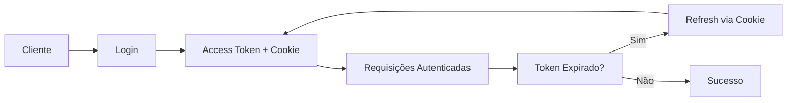

# 🔐 SIGAC API - Documentação de Integração de Autenticação

## 📋 Sumário

- [Visão Geral](#visão-geral)
- [Fluxo de Autenticação](#fluxo-de-autenticação)
- [Endpoints Disponíveis](#endpoints-disponíveis)
- [Estruturas de Dados](#estruturas-de-dados)
- [Exemplos de Integração](#exemplos-de-integração)
- [Tratamento de Erros](#tratamento-de-erros)
- [Segurança](#segurança)
- [Configuração do Cliente](#configuração-do-cliente)

---

## 🔍 Visão Geral

O sistema SIGAC utiliza autenticação baseada em **JWT (JSON Web Tokens)** com estratégia híbrida de segurança:

- **Access Token**: Enviado no cabeçalho `Authorization` (Bearer Token)
- **Refresh Token**: Armazenado em cookie HTTP-only seguro
- **Controle de Acesso**: Baseado em roles (ADMIN, EMPLOYEE, CLIENT)

### 🏗️ Arquitetura de Segurança



---

## 🔄 Fluxo de Autenticação

### 1. **Login**
```
POST /auth/login
```

### 2. **Acesso a Recursos**
```
GET /api/resource
Header: Authorization: Bearer {access_token}
```

### 3. **Renovação de Token**
```
POST /auth/refresh
Cookie: sigac_refresh_token={refresh_token}
```

### 4. **Logout**
```
POST /auth/logout
```

---

## 🚀 Endpoints Disponíveis

### 🔑 **1. Login**

**Endpoint:** `POST /auth/login`

**Headers:**
```
Content-Type: application/json
```

**Request Body:**
```json
{
  "cpf": "36900271014",
  "password": "senhaSegura123!"
}
```

**Response (201 Created):**
```json
{
  "timestamp": "2025-07-02T10:30:00.000",
  "message": "Resource created successfully",
  "data": {
    "token": "eyJhbGciOiJIUzI1NiIsInR5cCI6IkpXVCJ9...",
    "tokenType": "Bearer",
    "expiresIn": 3600,
    "user": {
      "cpf": "36900271014",
      "name": "João Silva",
      "email": "admin@sigac.com",
      "role": "ADMIN"
    }
  }
}
```

**Cookies Definidos:**
```
Set-Cookie: sigac_refresh_token={refresh_token}; HttpOnly; Secure; SameSite=Strict; Max-Age=604800; Path=/
```

---

### 🔄 **2. Refresh Token**

**Endpoint:** `POST /auth/refresh`

**Headers:**
```
Cookie: sigac_refresh_token={refresh_token}
```

**Response (200 OK):**
```json
{
  "timestamp": "2025-07-02T10:35:00.000",
  "message": "Success",
  "data": {
    "token": "eyJhbGciOiJIUzI1NiIsInR5cCI6IkpXVCJ9...",
    "tokenType": "Bearer",
    "expiresIn": 3600,
    "user": {
      "cpf": "36900271014",
      "name": "João Silva",
      "email": "admin@sigac.com",
      "role": "ADMIN"
    }
  }
}
```

---

### 👤 **3. Informações do Usuário**

**Endpoint:** `GET /auth/me`

**Headers:**
```
Authorization: Bearer {access_token}
```

**Response (200 OK):**
```json
{
  "timestamp": "2025-07-02T10:40:00.000",
  "message": "Success",
  "data": {
    "cpf": "36900271014",
    "name": "João Silva",
    "email": "admin@sigac.com",
    "role": "ADMIN"
  }
}
```

---

### 🚪 **4. Logout**

**Endpoint:** `POST /auth/logout`

**Headers:**
```
Cookie: sigac_refresh_token={refresh_token}
```

**Response (200 OK):**
```json
{
  "timestamp": "2025-07-02T10:45:00.000",
  "message": "Logged out successfully",
  "data": null
}
```

**Cookies Limpos:**
```
Set-Cookie: sigac_refresh_token=; HttpOnly; Secure; SameSite=Strict; Max-Age=0; Path=/
```

---

### 🏥 **5. Health Check**

**Endpoint:** `GET /auth/health`

**Response (200 OK):**
```json
{
  "timestamp": "2025-07-02T10:50:00.000",
  "message": "Authentication service is running",
  "data": null
}
```

---

## 📊 Estruturas de Dados

### 🔐 **LoginRequest**
```typescript
interface LoginRequest {
  cpf: string;        // CPF do usuário (formato: 36900271014)
  password: string;   // Senha do usuário
}
```

### 🎫 **LoginResponse**
```typescript
interface LoginResponse {
  token: string;      // JWT Access Token
  tokenType: string;  // Sempre "Bearer"
  expiresIn: number;  // Tempo de expiração em segundos
  user: UserInfo;     // Informações do usuário
}
```

### 👤 **UserInfo**
```typescript
interface UserInfo {
  cpf: string;        // CPF do usuário
  name: string;       // Nome completo
  email: string;      // Email
  role: string;       // Role: "ADMIN" | "EMPLOYEE" | "CLIENT"
}
```

### 📤 **ApiResponse**
```typescript
interface ApiResponse<T> {
  timestamp: string;  // ISO 8601 timestamp
  message: string;    // Mensagem de status
  data: T | null;     // Dados da resposta
}
```

### ❌ **ErrorResponse**
```typescript
interface ErrorResponse {
  timestamp: string;  // ISO 8601 timestamp
  status: number;     // HTTP status code
  error: string;      // Nome do erro HTTP
  message: string;    // Mensagem de erro detalhada
  errorCode: string;  // Código de erro específico
}
```

---

## 🛠️ Exemplos de Integração

### 🌐 **JavaScript/TypeScript (Fetch API)**

```typescript
class SigacAuthClient {
  private baseUrl = 'http://localhost:8080';
  private accessToken: string | null = null;

  // Login
  async login(cpf: string, password: string): Promise<UserInfo> {
    const response = await fetch(`${this.baseUrl}/auth/login`, {
      method: 'POST',
      headers: {
        'Content-Type': 'application/json',
      },
      credentials: 'include', // Importante para cookies
      body: JSON.stringify({ cpf, password }),
    });

    if (!response.ok) {
      throw new Error('Login failed');
    }

    const result = await response.json();
    this.accessToken = result.data.token;
    return result.data.user;
  }

  // Requisição autenticada
  async authenticatedRequest(url: string, options: RequestInit = {}) {
    return fetch(`${this.baseUrl}${url}`, {
      ...options,
      headers: {
        ...options.headers,
        'Authorization': `Bearer ${this.accessToken}`,
      },
      credentials: 'include',
    });
  }

  // Refresh token
  async refreshToken(): Promise<void> {
    const response = await fetch(`${this.baseUrl}/auth/refresh`, {
      method: 'POST',
      credentials: 'include',
    });

    if (response.ok) {
      const result = await response.json();
      this.accessToken = result.data.token;
    } else {
      // Redirect to login
      this.accessToken = null;
    }
  }

  // Logout
  async logout(): Promise<void> {
    await fetch(`${this.baseUrl}/auth/logout`, {
      method: 'POST',
      credentials: 'include',
    });
    this.accessToken = null;
  }
}
```

### ⚛️ **React Hook**

```typescript
import { useState, useEffect, createContext, useContext } from 'react';

interface AuthContextType {
  user: UserInfo | null;
  login: (cpf: string, password: string) => Promise<void>;
  logout: () => Promise<void>;
  isAuthenticated: boolean;
  isLoading: boolean;
}

const AuthContext = createContext<AuthContextType | null>(null);

export const AuthProvider: React.FC<{ children: React.ReactNode }> = ({ children }) => {
  const [user, setUser] = useState<UserInfo | null>(null);
  const [isLoading, setIsLoading] = useState(true);
  const authClient = new SigacAuthClient();

  // Verificar se já está autenticado ao carregar
  useEffect(() => {
    checkAuth();
  }, []);

  const checkAuth = async () => {
    try {
      const response = await authClient.authenticatedRequest('/auth/me');
      if (response.ok) {
        const result = await response.json();
        setUser(result.data);
      }
    } catch (error) {
      console.error('Auth check failed:', error);
    } finally {
      setIsLoading(false);
    }
  };

  const login = async (cpf: string, password: string) => {
    const userInfo = await authClient.login(cpf, password);
    setUser(userInfo);
  };

  const logout = async () => {
    await authClient.logout();
    setUser(null);
  };

  return (
    <AuthContext.Provider value={{
      user,
      login,
      logout,
      isAuthenticated: !!user,
      isLoading,
    }}>
      {children}
    </AuthContext.Provider>
  );
};

export const useAuth = () => {
  const context = useContext(AuthContext);
  if (!context) {
    throw new Error('useAuth must be used within AuthProvider');
  }
  return context;
};
```

### 📱 **Interceptor para Axios**

```typescript
import axios, { AxiosRequestConfig, AxiosResponse } from 'axios';

const apiClient = axios.create({
  baseURL: 'http://localhost:8080',
  withCredentials: true, // Para cookies
});

// Interceptor de requisição
apiClient.interceptors.request.use((config: AxiosRequestConfig) => {
  const token = localStorage.getItem('access_token');
  if (token) {
    config.headers.Authorization = `Bearer ${token}`;
  }
  return config;
});

// Interceptor de resposta para refresh automático
apiClient.interceptors.response.use(
  (response: AxiosResponse) => response,
  async (error) => {
    if (error.response?.status === 401 && !error.config._retry) {
      error.config._retry = true;
      
      try {
        const refreshResponse = await axios.post('/auth/refresh', {}, {
          withCredentials: true,
        });
        
        const newToken = refreshResponse.data.data.token;
        localStorage.setItem('access_token', newToken);
        
        // Retry original request
        error.config.headers.Authorization = `Bearer ${newToken}`;
        return apiClient.request(error.config);
      } catch (refreshError) {
        // Redirect to login
        localStorage.removeItem('access_token');
        window.location.href = '/login';
      }
    }
    
    return Promise.reject(error);
  }
);
```

---

## ⚠️ Tratamento de Erros

### 🔢 **Códigos de Status HTTP**

| Status | Descrição | Ação Recomendada |
|--------|-----------|------------------|
| `200` | Sucesso | Continuar |
| `201` | Criado com sucesso | Continuar |
| `400` | Dados inválidos | Verificar entrada do usuário |
| `401` | Não autorizado | Fazer login ou refresh |
| `403` | Acesso negado | Verificar permissões |
| `404` | Recurso não encontrado | Verificar URL |
| `409` | Conflito | Recurso já existe |
| `500` | Erro interno | Tentar novamente mais tarde |

### 🏷️ **Códigos de Erro Específicos**

| Error Code | Descrição | Ação |
|------------|-----------|------|
| `INVALID_CREDENTIALS` | CPF ou senha incorretos | Verificar credenciais |
| `INVALID_REFRESH_TOKEN` | Refresh token inválido | Fazer login novamente |
| `MISSING_REFRESH_TOKEN` | Cookie não encontrado | Fazer login novamente |
| `INVALID_TOKEN_TYPE` | Tipo de token incorreto | Verificar implementação |
| `USER_NOT_FOUND` | Usuário não existe | Verificar cadastro |
| `VALIDATION_ERROR` | Erro de validação | Corrigir dados |

### 🎯 **Exemplo de Tratamento**

```typescript
async function handleApiCall(apiCall: () => Promise<Response>) {
  try {
    const response = await apiCall();
    
    if (!response.ok) {
      const errorData = await response.json();
      
      switch (errorData.errorCode) {
        case 'INVALID_CREDENTIALS':
          throw new Error('CPF ou senha incorretos');
        case 'INVALID_REFRESH_TOKEN':
          // Redirect to login
          window.location.href = '/login';
          break;
        default:
          throw new Error(errorData.message);
      }
    }
    
    return response.json();
  } catch (error) {
    console.error('API Error:', error);
    throw error;
  }
}
```

---

## 🔒 Segurança

### 🛡️ **Boas Práticas Implementadas**

1. **JWT Tokens:**
   - Access tokens com expiração curta (1 hora)
   - Refresh tokens com expiração longa (7 dias)
   - Assinatura HMAC SHA-256

2. **Cookies Seguros:**
   - `HttpOnly`: Não acessível via JavaScript
   - `Secure`: Apenas HTTPS (produção)
   - `SameSite=Strict`: Proteção CSRF
   - `Path=/`: Escopo limitado

3. **Validação:**
   - CPF válido obrigatório
   - Senhas com critérios de segurança
   - Rate limiting (recomendado)

### 🔐 **Configurações de Produção**

```properties
# JWT Security
sigac.jwt.secret=${JWT_SECRET:your-256-bit-secret}
sigac.jwt.access-token-expiration=3600
sigac.jwt.refresh-token-expiration=604800

# CORS
sigac.security.cors.allowed-origins=https://yourdomain.com
sigac.security.cors.allow-credentials=true
```

### ⚡ **Recomendações do Cliente**

1. **Armazenamento:**
   - Access token: Memória ou sessionStorage
   - Refresh token: Cookie automático
   - **Nunca** localStorage para tokens

2. **HTTPS:**
   - Obrigatório em produção
   - Certificado SSL válido

3. **Timeout:**
   - Implementar timeout nas requisições
   - Retry automático com exponential backoff

---

## ⚙️ Configuração do Cliente

### 🌍 **Variáveis de Ambiente**

```bash
# Frontend (.env)
REACT_APP_API_URL=http://localhost:8080
REACT_APP_API_TIMEOUT=10000

# Produção
REACT_APP_API_URL=https://api.sigac.com
REACT_APP_API_TIMEOUT=5000
```

### 🔧 **Headers Obrigatórios**

```typescript
const defaultHeaders = {
  'Content-Type': 'application/json',
  'Accept': 'application/json',
};

// Para requisições autenticadas
const authHeaders = {
  ...defaultHeaders,
  'Authorization': `Bearer ${accessToken}`,
};
```

### 🍪 **Configuração de Cookies**

```typescript
// Axios
axios.defaults.withCredentials = true;

// Fetch
fetch(url, {
  credentials: 'include',
  // ... other options
});
```

---

## 🚨 Troubleshooting

### ❓ **Problemas Comuns**

1. **Cookie não está sendo enviado:**
   - Verificar `withCredentials: true`
   - Verificar configuração CORS
   - Verificar se domínios coincidem

2. **Token expira muito rápido:**
   - Implementar refresh automático
   - Verificar configuração de tempo

3. **CORS Error:**
   - Configurar origins permitidas
   - Verificar métodos e headers

4. **401 Unauthorized:**
   - Verificar se token está sendo enviado
   - Verificar formato do header Authorization
   - Tentar refresh token

### 🔍 **Debug**

```typescript
// Verificar se cookie está presente
console.log('Cookies:', document.cookie);

// Verificar headers da requisição
console.log('Request headers:', request.headers);

// Verificar resposta da API
console.log('Response:', await response.json());
```

---

## 📞 Suporte

Para dúvidas ou problemas:

1. **Documentação Técnica:** Este documento
2. **Logs da API:** Verificar logs do servidor
3. **Status Health:** `GET /auth/health`
4. **Códigos de Erro:** Consultar tabela de códigos

---

*Última atualização: 02/07/2025 - v1.0.0*
