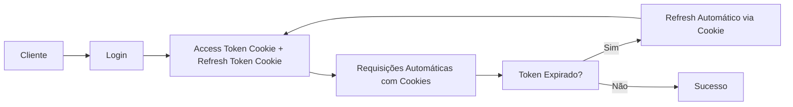

# 🔐 SIGAC API - Documentação de Integração de Autenticação

## 🎉 **NOVA VERSÃO 2.0.0 - 100% Cookie Based Authentication**

### ✨ **O que mudou:**
- 🍪 **Autenticação 100% via cookies**: Não precisa mais enviar tokens manualmente!
- 🚫 **Sem header Authorization**: Cookies HTTP-only automáticos
- 🔄 **Refresh automático**: Renovação de tokens transparente
- 🛡️ **Mais seguro**: Tokens inacessíveis via JavaScript
- 🌐 **CORS simplificado**: Apenas `credentials: 'include'`

### 🚀 **Principais benefícios:**
- **Zero gerenciamento manual de tokens**
- **Renovação automática e transparente**
- **Maior segurança contra XSS**
- **Integração mais simples**
- **Compatível com qualquer framework frontend**

---

## 📋 Sumário

- [Visão Geral](#visão-geral)
- [Fluxo de Autenticação](#fluxo-de-autenticação)
- [Endpoints Disponíveis](#endpoints-disponíveis)
- [Estruturas de Dados](#estruturas-de-dados)
- [Exemplos de Integração](#exemplos-de-integração)
- [Tratamento de Erros](#tratamento-de-erros)
- [Segurança](#segurança)
- [Configuração do Cliente](#configuração-do-cliente)

---

## 🔍 Visão Geral

O sistema SIGAC utiliza autenticação baseada em **JWT (JSON Web Tokens)** com estratégia **100% via cookies**:

- **Access Token**: Armazenado em cookie HTTP-only seguro (`sigac_access_token`)
- **Refresh Token**: Armazenado em cookie HTTP-only seguro (`sigac_refresh_token`)
- **Controle de Acesso**: Baseado em roles (ADMIN, EMPLOYEE, CLIENT)
- **🎯 Sem necessidade de enviar tokens manualmente**: Tudo é gerenciado automaticamente via cookies!

### 🏗️ Arquitetura de Segurança



---

## 🔄 Fluxo de Autenticação

### 1. **Login**
```
POST /auth/login
```

### 2. **Acesso a Recursos (Automático via Cookie!)**
```
GET /api/resource
Cookie: sigac_access_token={access_token} (automático)
```

### 3. **Renovação de Token (Automática via Cookie!)**
```
POST /auth/refresh
Cookie: sigac_refresh_token={refresh_token} (automático)
```

### 4. **Logout**
```
POST /auth/logout
```

---

## 🚀 Endpoints Disponíveis

### 🔑 **1. Login**

**Endpoint:** `POST /auth/login`

**Headers:**
```
Content-Type: application/json
```

**Request Body:**
```json
{
  "cpf": "36900271014",
  "password": "senhaSegura123!"
}
```

**Response (201 Created):**
```json
{
  "timestamp": "2025-07-02T10:30:00.000",
  "message": "Resource created successfully",
  "data": {
    "message": "Login successful",
    "user": {
      "cpf": "36900271014",
      "name": "João Silva",
      "email": "admin@sigac.com",
      "role": "ADMIN"
    }
  }
}
```

**Cookies Definidos (Automáticos):**
```
Set-Cookie: sigac_access_token={access_token}; HttpOnly; Secure; SameSite=Lax; Max-Age=3600; Path=/
Set-Cookie: sigac_refresh_token={refresh_token}; HttpOnly; Secure; SameSite=Lax; Max-Age=604800; Path=/
```

---

### 🔄 **2. Refresh Token**

**Endpoint:** `POST /auth/refresh`

**Headers (Automático):**
```
Cookie: sigac_refresh_token={refresh_token}
```

**Response (200 OK):**
```json
{
  "timestamp": "2025-07-02T10:35:00.000",
  "message": "Success",
  "data": {
    "message": "Login successful",
    "user": {
      "cpf": "36900271014",
      "name": "João Silva",
      "email": "admin@sigac.com",
      "role": "ADMIN"
    }
  }
}
```

**Cookies Atualizados (Automáticos):**
```
Set-Cookie: sigac_access_token={new_access_token}; HttpOnly; Secure; SameSite=Lax; Max-Age=3600; Path=/
Set-Cookie: sigac_refresh_token={new_refresh_token}; HttpOnly; Secure; SameSite=Lax; Max-Age=604800; Path=/
```

---

### 👤 **3. Informações do Usuário**

**Endpoint:** `GET /auth/me`

**Headers (Automático):**
```
Cookie: sigac_access_token={access_token}
```

**Response (200 OK):**
```json
{
  "timestamp": "2025-07-02T10:40:00.000",
  "message": "Success",
  "data": {
    "cpf": "36900271014",
    "name": "João Silva",
    "email": "admin@sigac.com",
    "role": "ADMIN"
  }
}
```

---

### 🚪 **4. Logout**

**Endpoint:** `POST /auth/logout`

**Headers (Automático):**
```
Cookie: sigac_refresh_token={refresh_token}
```

**Response (200 OK):**
```json
{
  "timestamp": "2025-07-02T10:45:00.000",
  "message": "Logged out successfully",
  "data": null
}
```

**Cookies Limpos (Automáticos):**
```
Set-Cookie: sigac_access_token=; HttpOnly; Secure; SameSite=Lax; Max-Age=0; Path=/
Set-Cookie: sigac_refresh_token=; HttpOnly; Secure; SameSite=Lax; Max-Age=0; Path=/
```

---

### 🏥 **5. Health Check**

**Endpoint:** `GET /auth/health`

**Response (200 OK):**
```json
{
  "timestamp": "2025-07-02T10:50:00.000",
  "message": "Authentication service is running",
  "data": null
}
```

---

## 📊 Estruturas de Dados

### 🔐 **LoginRequest**
```typescript
interface LoginRequest {
  cpf: string;        // CPF do usuário (formato: 36900271014)
  password: string;   // Senha do usuário
}
```

### 🎫 **LoginResponse (Simplificada - 100% Cookie)**
```typescript
interface CookieLoginResponse {
  message: string;    // Mensagem de sucesso
  user: UserInfo;     // Informações do usuário
}
```

### 👤 **UserInfo**
```typescript
interface UserInfo {
  cpf: string;        // CPF do usuário
  name: string;       // Nome completo
  email: string;      // Email
  role: string;       // Role: "ADMIN" | "EMPLOYEE" | "CLIENT"
}
```

### 📤 **ApiResponse**
```typescript
interface ApiResponse<T> {
  timestamp: string;  // ISO 8601 timestamp
  message: string;    // Mensagem de status
  data: T | null;     // Dados da resposta
}
```

### ❌ **ErrorResponse**
```typescript
interface ErrorResponse {
  timestamp: string;  // ISO 8601 timestamp
  status: number;     // HTTP status code
  error: string;      // Nome do erro HTTP
  message: string;    // Mensagem de erro detalhada
  errorCode: string;  // Código de erro específico
}
```

---

## 🛠️ Exemplos de Integração

### 🌐 **JavaScript/TypeScript (Fetch API) - 100% Cookie Based**

```typescript
class SigacAuthClient {
  private baseUrl = 'http://localhost:8080';

  // Login - Apenas envie credenciais, tokens são automáticos via cookies!
  async login(cpf: string, password: string): Promise<UserInfo> {
    const response = await fetch(`${this.baseUrl}/auth/login`, {
      method: 'POST',
      headers: {
        'Content-Type': 'application/json',
      },
      credentials: 'include', // 🔑 ESSENCIAL para cookies automáticos
      body: JSON.stringify({ cpf, password }),
    });

    if (!response.ok) {
      throw new Error('Login failed');
    }

    const result = await response.json();
    // 🎉 Não precisa mais armazenar token! Está tudo nos cookies
    return result.data.user;
  }

  // Requisição autenticada - SEM necessidade de token manual!
  async authenticatedRequest(url: string, options: RequestInit = {}) {
    return fetch(`${this.baseUrl}${url}`, {
      ...options,
      // 🚫 NÃO precisa mais do header Authorization!
      credentials: 'include', // 🔑 ESSENCIAL para enviar cookies automaticamente
    });
  }

  // Refresh token - Completamente automático!
  async refreshToken(): Promise<void> {
    const response = await fetch(`${this.baseUrl}/auth/refresh`, {
      method: 'POST',
      credentials: 'include', // 🔑 Cookies enviados e recebidos automaticamente
    });

    if (!response.ok) {
      // Redirect to login se refresh falhar
      window.location.href = '/login';
    }
    // 🎉 Novos tokens já estão nos cookies automaticamente!
  }

  // Logout - Limpa todos os cookies automaticamente
  async logout(): Promise<void> {
    await fetch(`${this.baseUrl}/auth/logout`, {
      method: 'POST',
      credentials: 'include', // 🔑 Para limpar os cookies
    });
    // 🎉 Cookies limpos automaticamente pelo servidor!
  }

  // Verificar se está autenticado - SEM token manual!
  async getCurrentUser(): Promise<UserInfo | null> {
    try {
      const response = await fetch(`${this.baseUrl}/auth/me`, {
        credentials: 'include', // 🔑 Cookie enviado automaticamente
      });
      
      if (response.ok) {
        const result = await response.json();
        return result.data;
      }
      return null;
    } catch (error) {
      return null;
    }
  }
}
```

### ⚛️ **React Hook - 100% Cookie Based**

```typescript
import { useState, useEffect, createContext, useContext } from 'react';

interface AuthContextType {
  user: UserInfo | null;
  login: (cpf: string, password: string) => Promise<void>;
  logout: () => Promise<void>;
  isAuthenticated: boolean;
  isLoading: boolean;
}

const AuthContext = createContext<AuthContextType | null>(null);

export const AuthProvider: React.FC<{ children: React.ReactNode }> = ({ children }) => {
  const [user, setUser] = useState<UserInfo | null>(null);
  const [isLoading, setIsLoading] = useState(true);
  const authClient = new SigacAuthClient();

  // Verificar se já está autenticado ao carregar - automático via cookie!
  useEffect(() => {
    checkAuth();
  }, []);

  const checkAuth = async () => {
    try {
      // 🎉 getCurrentUser usa cookies automaticamente!
      const userInfo = await authClient.getCurrentUser();
      setUser(userInfo);
    } catch (error) {
      console.error('Auth check failed:', error);
    } finally {
      setIsLoading(false);
    }
  };

  const login = async (cpf: string, password: string) => {
    // 🎉 Login configura cookies automaticamente!
    const userInfo = await authClient.login(cpf, password);
    setUser(userInfo);
  };

  const logout = async () => {
    // 🎉 Logout limpa cookies automaticamente!
    await authClient.logout();
    setUser(null);
  };

  return (
    <AuthContext.Provider value={{
      user,
      login,
      logout,
      isAuthenticated: !!user,
      isLoading,
    }}>
      {children}
    </AuthContext.Provider>
  );
};

export const useAuth = () => {
  const context = useContext(AuthContext);
  if (!context) {
    throw new Error('useAuth must be used within AuthProvider');
  }
  return context;
};
```

### 📱 **Interceptor para Axios - 100% Cookie Based**

```typescript
import axios, { AxiosRequestConfig, AxiosResponse } from 'axios';

const apiClient = axios.create({
  baseURL: 'http://localhost:8080',
  withCredentials: true, // 🔑 ESSENCIAL para cookies automáticos
});

// 🚫 NÃO precisa mais de interceptor de requisição para adicionar token!
// Os cookies são enviados automaticamente

// Interceptor de resposta para refresh automático
apiClient.interceptors.response.use(
  (response: AxiosResponse) => response,
  async (error) => {
    if (error.response?.status === 401 && !error.config._retry) {
      error.config._retry = true;
      
      try {
        // 🎉 Refresh automático via cookies!
        await axios.post('/auth/refresh', {}, {
          withCredentials: true,
        });
        
        // 🎉 Novos tokens já estão nos cookies automaticamente!
        // Retry original request (cookies serão enviados automaticamente)
        return apiClient.request(error.config);
      } catch (refreshError) {
        // Redirect to login se refresh falhar
        window.location.href = '/login';
      }
    }
    
    return Promise.reject(error);
  }
);

// Exemplo de uso simplificado
export const authApi = {
  login: (cpf: string, password: string) =>
    apiClient.post('/auth/login', { cpf, password }),
  
  getCurrentUser: () =>
    apiClient.get('/auth/me'), // 🎉 Cookie enviado automaticamente!
  
  logout: () =>
    apiClient.post('/auth/logout'), // 🎉 Cookies limpos automaticamente!
  
  // Qualquer endpoint protegido funciona automaticamente!
  getUsers: () =>
    apiClient.get('/users'), // 🎉 Autenticação automática via cookie!
};
```

---

## ⚠️ Tratamento de Erros

### 🔢 **Códigos de Status HTTP**

| Status | Descrição | Ação Recomendada |
|--------|-----------|------------------|
| `200` | Sucesso | Continuar |
| `201` | Criado com sucesso | Continuar |
| `400` | Dados inválidos | Verificar entrada do usuário |
| `401` | Não autorizado | Fazer login ou refresh |
| `403` | Acesso negado | Verificar permissões |
| `404` | Recurso não encontrado | Verificar URL |
| `409` | Conflito | Recurso já existe |
| `500` | Erro interno | Tentar novamente mais tarde |

### 🏷️ **Códigos de Erro Específicos**

| Error Code | Descrição | Ação |
|------------|-----------|------|
| `INVALID_CREDENTIALS` | CPF ou senha incorretos | Verificar credenciais |
| `INVALID_REFRESH_TOKEN` | Refresh token inválido | Fazer login novamente |
| `MISSING_REFRESH_TOKEN` | Cookie não encontrado | Fazer login novamente |
| `MISSING_TOKEN` | Cookie de access token não encontrado | Fazer refresh ou login |
| `INVALID_TOKEN_TYPE` | Tipo de token incorreto | Verificar implementação |
| `USER_NOT_FOUND` | Usuário não existe | Verificar cadastro |
| `VALIDATION_ERROR` | Erro de validação | Corrigir dados |

### 🎯 **Exemplo de Tratamento**

```typescript
async function handleApiCall(apiCall: () => Promise<Response>) {
  try {
    const response = await apiCall();
    
    if (!response.ok) {
      const errorData = await response.json();
      
      switch (errorData.errorCode) {
        case 'INVALID_CREDENTIALS':
          throw new Error('CPF ou senha incorretos');
        case 'INVALID_REFRESH_TOKEN':
          // Redirect to login
          window.location.href = '/login';
          break;
        default:
          throw new Error(errorData.message);
      }
    }
    
    return response.json();
  } catch (error) {
    console.error('API Error:', error);
    throw error;
  }
}
```

---

## 🔒 Segurança

### 🛡️ **Boas Práticas Implementadas**

1. **JWT Tokens:**
   - Access tokens com expiração curta (1 hora)
   - Refresh tokens com expiração longa (7 dias)
   - Assinatura HMAC SHA-256

2. **Cookies Seguros:**
   - `HttpOnly`: Não acessível via JavaScript
   - `Secure`: Apenas HTTPS (produção, `false` em desenvolvimento)
   - `SameSite=Lax`: Compatível com CORS, proteção CSRF
   - `Path=/`: Escopo limitado
   - **Access Token Cookie**: `sigac_access_token` (1 hora)
   - **Refresh Token Cookie**: `sigac_refresh_token` (7 dias)

3. **Validação:**
   - CPF válido obrigatório
   - Senhas com critérios de segurança
   - Rate limiting (recomendado)

### 🔐 **Configurações de Produção**

```properties
# JWT Security
sigac.jwt.secret=${JWT_SECRET:your-256-bit-secret}
sigac.jwt.access-token-expiration=3600
sigac.jwt.refresh-token-expiration=604800

# CORS
sigac.security.cors.allowed-origins=https://yourdomain.com
sigac.security.cors.allow-credentials=true
```

### ⚡ **Recomendações do Cliente**

1. **🍪 Armazenamento (100% Automático):**
   - **Access Token**: Cookie HTTP-only (automático)
   - **Refresh Token**: Cookie HTTP-only (automático)
   - **🚫 NÃO use localStorage ou sessionStorage para tokens**
   - **🎉 Sem gerenciamento manual de tokens!**

2. **HTTPS:**
   - Obrigatório em produção
   - Certificado SSL válido
   - Em desenvolvimento: HTTP funciona (configuração automática)

3. **Timeout e Configuração:**
   - Sempre usar `credentials: 'include'` (Fetch) ou `withCredentials: true` (Axios)
   - Implementar timeout nas requisições
   - Retry automático com exponential backoff

---

## ⚙️ Configuração do Cliente

### 🌍 **Variáveis de Ambiente**

```bash
# Frontend (.env)
REACT_APP_API_URL=http://localhost:8080
REACT_APP_API_TIMEOUT=10000

# Produção
REACT_APP_API_URL=https://api.sigac.com
REACT_APP_API_TIMEOUT=5000
```

### 🔧 **Headers Obrigatórios (Simplificados!)**

```typescript
const defaultHeaders = {
  'Content-Type': 'application/json',
  'Accept': 'application/json',
};

// 🎉 Para requisições autenticadas: APENAS cookies!
// NÃO precisa mais de header Authorization
```

### 🍪 **Configuração de Cookies (ESSENCIAL!)**

```typescript
// Axios - SEMPRE necessário para cookies
axios.defaults.withCredentials = true;

// Fetch - SEMPRE necessário para cookies
fetch(url, {
  credentials: 'include', // 🔑 OBRIGATÓRIO para cookies automáticos
  // ... other options
});

// XMLHttpRequest
xhr.withCredentials = true;
```

---

## 🚨 Troubleshooting

### ❓ **Problemas Comuns**

1. **Cookie não está sendo enviado:**
   - ✅ Verificar `withCredentials: true` (Axios) ou `credentials: 'include'` (Fetch)
   - ✅ Verificar configuração CORS no servidor
   - ✅ Verificar se domínios coincidem (localhost:3000 ↔ localhost:8080)
   - ✅ Verificar se `SameSite=Lax` está configurado

2. **401 Unauthorized:**
   - ✅ Verificar se cookies estão sendo enviados (`credentials: 'include'`)
   - ✅ Verificar se o cookie `sigac_access_token` existe
   - ✅ Tentar refresh automático
   - ✅ Verificar se o servidor está aceitando cookies

3. **CORS Error:**
   - ✅ Configurar `sigac.security.cors.allowed-origins` no servidor
   - ✅ Configurar `sigac.security.cors.allow-credentials=true`
   - ✅ Verificar métodos e headers permitidos

4. **Cookie expira muito rápido:**
   - ✅ Implementar refresh automático com interceptor
   - ✅ Verificar configuração de tempo no servidor

### 🔍 **Debug**

```typescript
// Verificar se cookies estão presentes
console.log('All cookies:', document.cookie);
console.log('Access token cookie:', document.cookie.includes('sigac_access_token'));
console.log('Refresh token cookie:', document.cookie.includes('sigac_refresh_token'));

// Verificar se credentials estão sendo enviados
fetch('/auth/me', { 
  credentials: 'include' 
}).then(response => {
  console.log('Response status:', response.status);
  console.log('Response headers:', response.headers);
});

// Verificar resposta da API
console.log('Response:', await response.json());

// Teste manual de autenticação
const testAuth = async () => {
  try {
    const response = await fetch('http://localhost:8080/auth/me', {
      credentials: 'include'
    });
    console.log('Auth test:', response.status === 200 ? 'SUCCESS' : 'FAILED');
  } catch (error) {
    console.error('Auth test error:', error);
  }
};
```

---

## 📞 Suporte

Para dúvidas ou problemas:

1. **Documentação Técnica:** Este documento
2. **Logs da API:** Verificar logs do servidor
3. **Status Health:** `GET /auth/health`
4. **Códigos de Erro:** Consultar tabela de códigos

---

*Última atualização: 05/07/2025 - v2.0.0 - 🍪 **100% Cookie Based Authentication***
